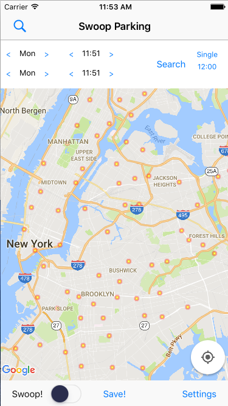
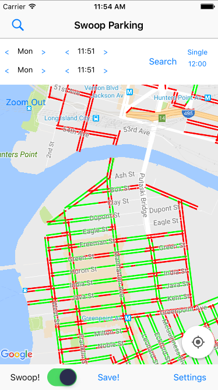

# Swoop in Swift
Swoop Parking App lets users know when and where cleaning is about to finish so that they can find street parking. Currently only available in NYC

<!-- 

 -->
Currently showing incorrect street level parking data. Will make it dynamic and synchronized with the time and day. 

## Installation
`git clone https://github.com/dknomura/SwoopInSwift.git `

Then run 
`pod install` 

### Requirements
- Xcode 7.3.1+
- iOS 9.3+

## License 
-Licensed under the Apache License, Version 2.0 (the "License"); you may not use this work except in compliance with the License. You may obtain a copy of the License in the LICENSE file, or at:

http://www.apache.org/licenses/LICENSE-2.0

Unless required by applicable law or agreed to in writing, software distributed under the License is distributed on an "AS IS" BASIS, WITHOUT WARRANTIES OR CONDITIONS OF ANY KIND, either express or implied. See the License for the specific language governing permissions and limitations under the License.
